# Claude Code 配置仓库

[](https://cksheuen.github.io/IMO/)

> 一个把 Claude Code 从”提示词集合”收敛成”可执行工作流”的配置仓库。

这个仓库现在的重点不是罗列目录，而是把几条真正会影响日常使用的运行链做实：任务闭环、上下文注入、自动治理、知识晋升。

## 安装方式

### 用户级安装

把仓库放到 `~/.claude/`，让 Claude Code 默认读取这套配置：

```bash
git clone <repo-url> ~/.claude
```

### 项目级安装

如果只想让某个项目使用这套配置，把仓库放到项目根下的 `.claude/`：

```bash
git clone <repo-url> .claude
```

### 安装后先做的 3 件事

1. 看 [`settings.json`](./settings.json)，确认 hooks 和权限是不是你要的默认基线。
2. 执行 `/promotion-mode status`，确认 Promotion Loop 当前是不是自动后台模式。
3. 看 [`CLAUDE.md`](./CLAUDE.md)，确认默认工作流和边界是否符合你的习惯。

## 先看这个风险：Promotion Loop 不要默认一直后台跑

`promotion-mode` 是最容易被误解的功能之一。它不是一个“开了总是更好”的开关。

当前仓库提交状态下，[`promotion-config.json`](./promotion-config.json) 里的 `autoBackgroundEnabled` 为 `true`。也就是说，如果你直接按当前配置使用，后台自动链路是允许继续工作的。

- `/promotion-mode on`：允许后台自动链路继续工作，可能带来额外 token 消耗
- `/promotion-mode off`：关闭后台自动模式，回到手动主路径
- `/promotion-mode status`：查看当前模式
- `/promote-notes`：手动推进 note 晋升

当前仓库的设计已经收敛为：

- 默认推荐理解：**手动 `/promote-notes` 为主**
- 自动模式的价值：保留扫描、排队、提醒等后台能力
- 自动模式的代价：可能产生你并不想要的后台 token 消耗

所以安装后不要假设它应该一直开着。更稳妥的做法是：

1. 先 `/promotion-mode status`
2. 如果你不希望后台持续消耗，立即 `/promotion-mode off`
3. 真要晋升时，再手动 `/promote-notes`

手动主路径：

```bash
python3 "$HOME/.claude/scripts/promote-notes-run.py" scan
python3 "$HOME/.claude/scripts/promote-notes-run.py" list
python3 "$HOME/.claude/scripts/promote-notes-run.py" claim --count 1
python3 "$HOME/.claude/scripts/promote-notes-run.py" stub-result
# 手动编辑 promotion-result.json
python3 "$HOME/.claude/scripts/promote-notes-run.py" apply
```

## 你实际高频使用的功能

下面这组优先级不是拍脑袋写的，而是参考了本地 `~/.claude/history.jsonl` 和 `~/.codex/history.jsonl` 的使用记录后收敛出来的。

### 1. `/brainstorm`

这是最明显的高频显式入口，适合在实现前先做需求发现、技术选型和结构收敛。

适合什么时候用：

- 需求还不够清楚
- 方案不止一条，需要调研后再收敛
- 你想先把边界、风险、未来演化想明白，再开始实现

典型用法：

- `/brainstorm`
- “先帮我调研，再给 MVP 路线”

### 2. `review / 审查`

从本地记录看，review 类请求一直很高频。这个仓库也确实更适合在这些场景里发挥价值：

- 改完 `rules/`、`skills/`、`hooks/` 后做风险审查
- 检查新流程有没有假闭环
- 先找 regression / 风险，再谈优化

典型用法：

- `/review`
- “帮我审一下这次改动”
- “重点看行为回归和漏测”

### 3. `skills / plugins` 相关探索

从调用记录看，你对 skill / plugin 的边界、同步和扩展非常高频。这也是这个仓库最核心的使用方向之一。

适合什么时候看这里：

- 想知道一个能力应该做成 `skill` 还是 `plugin`
- 想给 Claude / Codex 增加新能力
- 想确认高频能力是否应该进入 `commands/` 成为显式入口

优先入口：

- [`skills/`](./skills/)
- [`commands/README.md`](./commands/README.md)
- [`settings.json`](./settings.json)

### 4. `/pencil-design`

你本地记录里 design 相关使用频率也不低。这里的 `design` 不是“给点颜色建议”，而是完整的 Pencil MCP 设计链。

适合什么时候用：

- 想做页面、原型、仪表盘、登录页
- 希望从模糊需求一路走到 `.pen` 文件和截图验证

典型用法：

- `/pencil-design`
- “帮我做一个 dashboard 的 UI 设计”

### 5. `/orchestrate`

`orchestrate` 的显式触发次数不算最多，但在 Codex 侧明显更常被用于大任务拆分。

适合什么时候用：

- 任务会改 `3+` 个文件
- 跨 `2+` 个领域
- 你明确想并行执行

典型用法：

- `/orchestrate`
- “先拆分执行，再并行推进”

## 这个项目真正有特色的地方

### 1. Hook-first，而不是 prompt-only

很多能力不是“写在文档里希望 agent 记住”，而是直接挂进运行时：

- `UserPromptSubmit`：注入 `skill-loader`、项目架构上下文和 recall 入口
- `PreToolUse`：经过 `scale-gate`、`pre-write-gate`、`pre-edit-gate`、`pre-agent-gate`
- `Stop`：执行 recall capture、context monitor

真实挂载入口见 [`settings.json`](./settings.json) 和 [`hooks/README.md`](./hooks/README.md)。

### 2. `tasks / notes / recall / memory` 分层明确

这里不把“当前任务”“长期知识”“跨轮恢复”“稳定事实”混在一起：

- [`tasks/`](./tasks/README.md)：当前任务事实
- [`notes/`](./notes/README.md)：可复用知识沉淀
- `recall/`：跨轮恢复提示
- `memory/`：更稳定的 declarative snapshot

### 3. Note 不是终点，Promotion Loop 才是闭环

`notes/` 不是最终仓库。稳定内容还会继续进入：

- `rules/`
- `skills/`
- `memory/`

但这条链路现在已经明确成了“**手动晋升为主，自动后台为辅**”，不会再把自动晋升包装成默认无害能力。

### 4. 有一整套治理型守门机制

这个仓库的强项不是功能堆叠，而是避免流程失真：

- `project-architecture-inject.py`
- `scale-gate.sh`
- `task-bootstrap.sh`
- `verification-gate.sh`（手动验证门禁工具，不作为自动 Stop hook 触发）
- `audit-runtime-links.py`
- `runtime-profile-audit.py`

## 仓库入口

如果你只想快速理解这个项目，从这几个入口开始就够了：

- [`CLAUDE.md`](./CLAUDE.md)：最小原则、默认工作流、必查规则入口
- [`settings.json`](./settings.json)：共享 runtime 的真实挂载点
- [`hooks/README.md`](./hooks/README.md)：hook 的边界、调用链和已接通链路
- [`rules/`](./rules/)：执行规范
- [`skills/`](./skills/)：可触发的完整工作流
- [`commands/README.md`](./commands/README.md)：显式 slash 命令入口

最小目录图：

```text
~/.claude/
├── CLAUDE.md
├── settings.json
├── hooks/
├── rules/
├── skills/
├── commands/
├── tasks/
├── notes/
├── recall/
└── memory/
```
